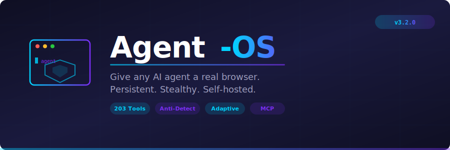

<!-- mcp-name: io.github.unknownsorcerer007/Agent-OS -->

<h1 align="center">
    <a href="https://github.com/unknownsorcerer007/Agent-OS-Final-Pro">
        <picture>
          <source media="(prefers-color-scheme: dark)" srcset="docs/cover_dark.svg">
          
        </picture>
    </a>
    <br>
</h1>

> [!IMPORTANT]
> **Project Acquisition & Sponsorship Notice**  
> Agent-OS is currently open for **acquisition or corporate sponsorship**. If you are an AI startup, developer tool company, or enterprise looking to acquire the technology stack, codebase IP, or sponsor its ongoing development, please contact us at **[unknownsorcerer007@gmail.com](mailto:unknownsorcerer007@gmail.com)**. *Serious inquiries only.*

> [!TIP]
> **⚡ The Next Frontier: Project SynapseLink (Classified Teaser)**  
> *What happens when AI steps out of the browser sandbox and into the physical world?*  
> 
> We are quietly developing **SynapseLink**—a highly secure, Model Context Protocol (MCP) compatible interface designed to allow LLMs to safely command and control physical hardware.
> 
> * **Universal Connectivity**: Dynamic, zero-friction discovery and communication across any cabled connection (USB/Serial) or wireless protocol (Bluetooth BLE / Wi-Fi).
> * **Edge Autonomy**: Register custom hardware configurations and deploy local LLM controllers (via Ollama) for offline reasoning at the boundary.
> * **Closed-Loop Execution**: Continuous hardware state monitoring and adaptive self-correction loops to ensure tasks finish successfully.
> 
> *The boundary between digital reasoning and physical action is dissolving.*
> 
> 🐦 Follow the journey, get exclusive sneak peeks, and secure early access: **[Twitter/X](https://x.com/YOUR_TWITTER_HANDLE)**.

<p align="center">
    <a href="LICENSE">
        
    </a>
    <a href="https://www.python.org/downloads/">
        
    </a>
    <a href="https://www.docker.com/">
        
    </a>
    
    
    <br/>
    <a href="https://github.com/unknownsorcerer007/Agent-OS-Final-Pro/stargazers">
        
    </a>
    <a href="https://github.com/unknownsorcerer007/Agent-OS-Final-Pro/network/members">
        
    </a>
</p>

<p align="center">
    <a href="#-core-use-cases"><strong>Core Use Cases</strong></a> &middot;
    <a href="#-architectural-highlights"><strong>Features</strong></a> &middot;
    <a href="#-connectors"><strong>Connectors</strong></a> &middot;
    <a href="#-quick-start"><strong>Quick Start</strong></a> &middot;
    <a href="#-interactive-setup-wizard"><strong>Setup Wizard</strong></a> &middot;
    <a href="#-test-suite--readiness"><strong>Verification</strong></a>
</p>

---

## 🌐 What is Agent-OS?

**Agent-OS** is an operating system layer that gives AI agents a **real, persistent, and self-hosted web browser** with zero-friction installation. 

It exposes **209 production-ready tools** for mouse interactions, form filling, data extraction, CAPTCHA bypass, and session persistence. Agent-OS turns your LLM (Claude Code, Cursor, GPT-4o, Claude Desktop, OpenClaw, or custom agents) into an autonomous web operator that can navigate complex sites, bypass CDNs, and complete multi-step workflows.

---

## 🎯 Core Use Cases

* **Autonomous Lead Generation & Form Filling**: Let AI search platforms, extract details, and fill out forms with built-in human-mimicking keystrokes and pointer trails.
* **Persistent Web Scraping (Self-Healing)**: Scraping pipelines that do not break when classes, IDs, or page layouts change.
* **Stealth Data Aggregation**: Access data protected by aggressive bot managers (Cloudflare, Akamai, Turnstile) using real browser spoofing and proxy rotation.
* **Human-in-the-Loop Operations**: Automate 99% of workflows; hand back browser window to a human for 2FA/OTP login validation, then resume.
* **Token-Optimized Automation**: Capture web states as lightweight semantic trees instead of raw HTML, saving 90%+ in LLM token usage.

---

## 🛡️ Key Architectural Features

### 1. Stealth & Evasion Engine (No-Mercy Anti-Detection)
Agent-OS defeats commercial bot detection systems (DataDome, PerimeterX, Cloudflare Bot Management, Turnstile, Kasada, hCaptcha) using a 4-layer defense system:
* **Layer 1 (Network)**: Emulates real Chrome/Firefox TLS handshakes (JA3/JA4 fingerprints) via `curl_cffi` to match client properties.
* **Layer 2 (CDP)**: Dynamic runtime scripting injection using `Page.addScriptToEvaluateOnNewDocument` to spoof User-Agents, screen configurations, and overrides.
* **Layer 3 (JavaScript)**: Spoofs WebGL/Canvas rendering, masks `navigator.webdriver` flags, overrides Speech/Audio synthesis signatures, and overrides RTC IP leaks.
* **Layer 4 (Behavior)**: Simulates human mouse movement paths (Bézier curves), natural typing speeds with randomized pauses, and realistic keystroke errors/corrections.

### 2. Self-Healing & Semantic Fallbacks
* **Smart Element Finder**: Bypasses rigid CSS/XPath selectors. Locates target elements using natural text, placeholder hints, labels, aria-labels, and alt texts.
* **Adaptive Relocator**: Generates multi-layered element fingerprints (tag names, path strings, parent contexts, text, size). If a website redesign breaks selectors, the relocator scans all page elements and relocates the target based on similarity scoring.

### 3. Frictionless LLM Key Routing & Setup Wizard
* **Skip ollama Dependencies**: Startup probing for local Ollama weights is completely bypassed unless `OLLAMA_HOST` is explicitly set, allowing instant deployment.
* **Interactive Setup Wizard**: Launches a shell command (`python main.py --setup`) to configure your standard API keys (`OPENAI_API_KEY`, `ANTHROPIC_API_KEY`, `DEEPSEEK_API_KEY`, `GEMINI_API_KEY`, `OPENROUTER_API_KEY`) and saves them directly to `.env`.

### 4. Human-In-The-Loop Login Handoff
* **Authentications Token Save & Restore**: Saves active sessions, cookies, and local storage tokens into a base64 encoded JSON string (`export-tokens`) to bypass login steps completely next time.
* **Manual Portals**: Automatically pauses agent script execution and opens a portal for a human user to complete MFA/2FA, resuming the automation immediately after.

### 5. Multi-Agent Swarm Hub
* Exposes distributed locks (`hub-lock`/`hub-unlock`) and shared memory spaces across agents.
* Allows seamless handoffs of browser control between different specialized swarm agents.

---

## ⚡ Quick Start

One command to install. One configuration to connect. Zero compilation dependencies required.

### 🪟 Windows Setup (PowerShell)

Open PowerShell as Administrator and execute:
```powershell
# Clone the repository
git clone https://github.com/unknownsorcerer007/Agent-OS-Final-Pro.git
cd Agent-OS-Final-Pro

# Run the frictionless installer (sets up venv, installs packages, sets up chromium)
.\install.ps1

# Run the interactive Setup Wizard to configure your API keys
.\venv\Scripts\python.exe main.py --setup

# Start the Agent-OS server
.\start.ps1
```

### 🍎 Mac / 🐧 Linux Setup

Open your terminal and execute:
```bash
# Clone the repository
git clone https://github.com/unknownsorcerer007/Agent-OS-Final-Pro.git
cd Agent-OS-Final-Pro

# Install dependencies (with no-compiler fallbacks for aiohttp, yarl, etc.)
./install.sh

# Run the Setup Wizard to configure API keys
./venv/bin/python main.py --setup

# Start the Agent-OS server
./venv/bin/python main.py --agent-token "dev-token"
```

> [!TIP]
> **Custom Security Passcode**: The `--agent-token` argument defines the security key for the server. You can set this to **any arbitrary custom string or password** you want. This key prevents unauthorized access to your browser control API. The same string must be used in your MCP connector or client configuration.

### 🐳 Docker Deployment

```bash
git clone https://github.com/unknownsorcerer007/Agent-OS-Final-Pro.git
cd Agent-OS-Final-Pro
export POSTGRES_PASSWORD="your-strong-password"
docker compose up -d
```

---

## 🔌 Connectors Config

Agent-OS supports 7 connector pipelines to wire into your favorite agentic stack.

### Model Context Protocol (MCP) Setup

You can connect Agent-OS browser tools directly to **Claude Desktop** or **Cursor** to let AI agents run browser commands.

#### Step 1: Locate your Claude Desktop configuration file
* **Windows**: `%APPDATA%\Claude\claude_desktop_config.json`
* **macOS**: `~/Library/Application Support/Claude/claude_desktop_config.json`
* **Linux**: `~/.config/Claude/claude_desktop_config.json`

#### Step 2: Add the server configuration
Open the configuration file and add the following entry under `"mcpServers"`. 

> [!IMPORTANT]
> If you started the server with a custom `--agent-token` passcode (e.g., `--agent-token "my-custom-password"`), you **MUST** provide it inside the `"env"` block as `AGENT_OS_TOKEN` so that the connector can authenticate. You can set this token to **any arbitrary string or password** of your choice.

##### Windows Configuration
```json
{
  "mcpServers": {
    "agent-os": {
      "command": "powershell.exe",
      "args": [
        "-ExecutionPolicy",
        "Bypass",
        "-File",
        "C:/Users/YOUR_USER/.gemini/antigravity/scratch/repo/Agent-OS-Final-Pro-main/run_mcp.ps1"
      ],
      "env": {
        "AGENT_OS_TOKEN": "dev-token"
      }
    }
  }
}
```

##### macOS / Linux Configuration
```json
{
  "mcpServers": {
    "agent-os": {
      "command": "bash",
      "args": [
        "/path/to/Agent-OS-Final-Pro/run_mcp.sh"
      ],
      "env": {
        "AGENT_OS_TOKEN": "dev-token"
      }
    }
  }
}
```

#### Step 3: Restart Claude Desktop
Restart the Claude Desktop application. You will see a new hammer icon or tool dropdown containing the 209 browser automation tools.

---

## 🧪 Test Suite & Readiness

We verify code quality, import structures, and browser capabilities before any release:

### 1. Run Unit & Integration Tests (175 tests)
```bash
# Restricted to the tests/ directory to avoid import-time script execution
.\venv\Scripts\pytest.exe
```
**Result**: `175 passed`

### 2. Run E2E Production Readiness Tests (51 checks)
```bash
# Verifies Router routing, LLM cache, swarm allocation, and parallel stress searches
$env:PYTHONIOENCODING="utf-8"
.\venv\Scripts\python.exe production_test.py
```
**Result**: `51 passed`

### 3. Verify Anti-Detection Stealth
```bash
# Tests the browser against Sannysoft WebDriver checks, NowSecure, and CreepJS fingerprint audits
.\venv\Scripts\python.exe run_stealth_tests.py
```
**Result**: `100% bypass success rate`

---

## 🛠️ Tool categories (209 Tools)

All 209 tools are organized across 30 distinct categories for easy ingestion:
* **`ADAPTIVE` (4 tools)**: Clean, find, and fingerprint elements.
* **`AI` (6 tools)**: Extraction, jobs filling, and data formatting.
* **`ANALYSIS` (9 tools)**: Emails, phones, SEO, accessibility audits, tables, and summaries.
* **`CAPTCHA` (6 tools)**: Assess, bypass system checks, and monitor.
* **`EXTRACTION` (9 tools)**: Screenshots, DOM trees, cookies, attributes, and JS evaluate.
* **`HANDOFF` (8 tools)**: Trigger and manage human-in-the-loop auth handbacks.
* **`HEAL` (10 tools)**: Smart clicks/fills with auto-healers.
* **`HUB` (23 tools)**: Distributed memory, locks, and task queues for agent swarms.
* **`INTERACTION` (18 tools)**: Clicks, inputs, keypresses, forms, drags, and scrolls.
* **`LLM` (7 tools)**: completions, summaries, classifications, and token usage.
* **`NAVIGATION` (5 tools)**: Navigate, smart fallback router, back, forward, and reloads.
* **`NETWORK` (8 tools)**: HAR exports, API endpoint discovery, and network capture.
* **`PROXY & ROTATION` (18 tools)**: Add proxies, rotate strategies, health checks, and metrics.
* **`RECORDING & REPLAY` (18 tools)**: Workflows recording, templates, and position triggers.
* **`RETRY` (10 tools)**: Navigations and clicks with budgets and circuit breakers.
* **`ROUTER` (6 tools)**: Needs-web query classification.
* **`SNAPSHOT` (3 tools)**: Token-saving accessibility trees with `@eN` refs.

> [!NOTE]
> For a full list of all 209 tools, their inputs, MCP mappings, and parameter descriptions, refer to the generated reference file: [agent_os_features_and_tools.md](file:///C:/Users/eourn/.gemini/antigravity/brain/83b8e4f3-4122-474f-9e4a-41da9bb0d247/agent_os_features_and_tools.md).

---

## 📄 License

* Licensed under the [Agent-OS Personal and Non-Commercial License](LICENSE) — free for personal, educational, and testing use. Commercial or production use by any business entity is strictly prohibited.